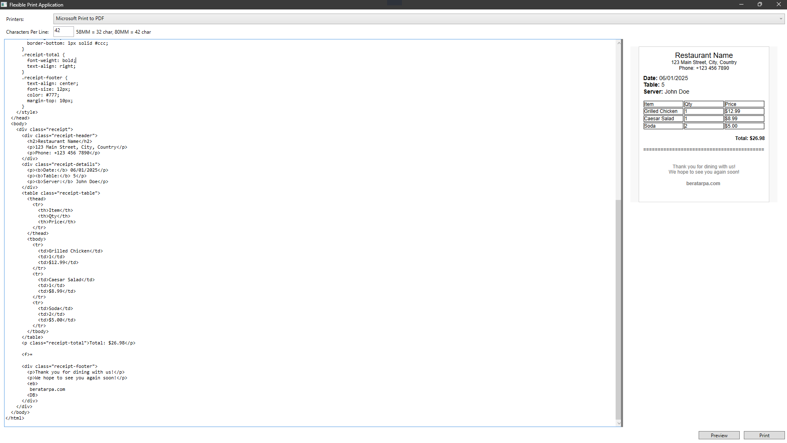
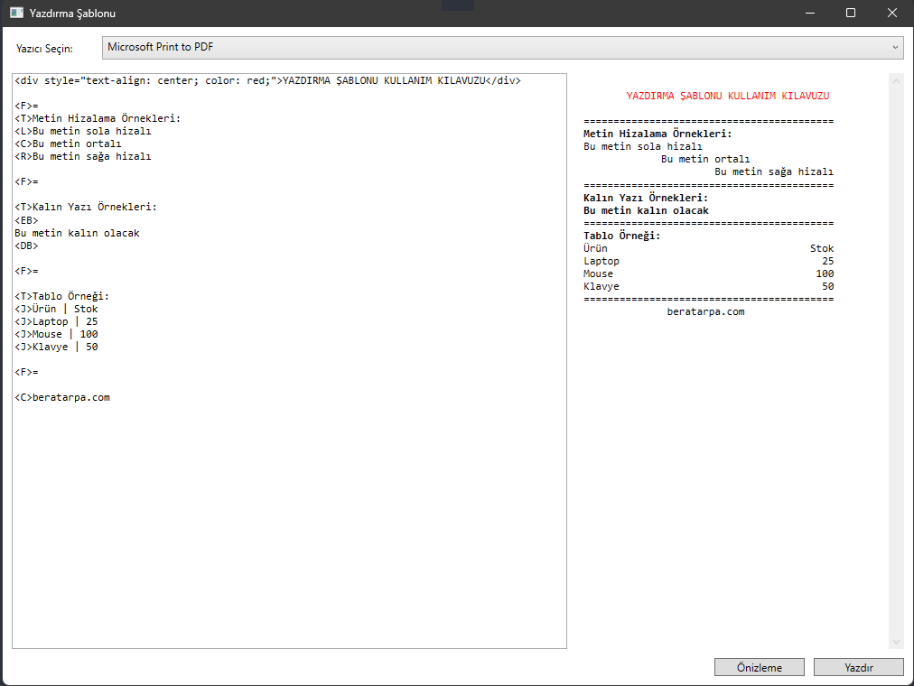

# HTML Thermal Printer

NuGet package:
https://www.nuget.org/packages/PrintHTML.Core

Basic usage:
```
AsyncPrintTask.Exec(
    true,
    () => _printerService.DoPrint(
        "content",                     // Content to print
        "PrinterName",                // Printer name
        "charactersPerLine(int) 58MM=32, 80MM=42"  // Characters per line
    )
);
```
---

## Screenshots



---
[EN]

## About Project
PrintHTML is a user-friendly WPF application that allows you to send HTML content directly to Windows printers. This application enables you to preview HTML content before printing and automatically detects all printers installed on the system.

### Features
- Direct HTML content printing
- Print preview functionality
- Automatic printer detection
- User-friendly interface
- Error handling and notifications

### Technical Details
- Framework: .NET (WPF)
- Language: C#
- Interface: XAML
- Architecture: Service-based architecture

### Usage
1. Launch the application
2. System printers will be automatically listed
3. Paste your HTML content into the text box
4. Optionally click "Preview" to check the output
5. Select a printer and click "Print"

### Requirements
- Windows operating system
- .NET Framework
- At least one system printer 

### Special Format Tags
Special format tags you can use in the application:

- `<L>` : Aligns text to the left
- `<C>` : Centers the text
- `<R>` : Aligns text to the right
- `<T>` : Makes text bold
- `<EB>` : Bold text start
- `<DB>` : Bold text end
- `<F>=` : Fills the line with the specified character (example: `<F>=` fills the entire line with = character)
- `<J>` : Creates a table. Columns are separated by | character (example: `<J>Product | Price | Stock`)

Example usage:
```
<div style="text-align: center; color: red;">HEADER</div>

<F>=
<T>Bold Header
<L>Left aligned text
<C>Centered text
<R>Right aligned text

<J>Product | Price
<J>Pencil | $10 
```
---
[TR]

## Proje Hakkında
PrintHTML, HTML içeriğini doğrudan Windows yazıcılarına göndermenizi sağlayan kullanıcı dostu bir WPF uygulamasıdır. Bu uygulama, HTML içeriğini yazdırmadan önce önizleme yapmanıza olanak tanır ve sistem üzerinde kurulu olan tüm yazıcıları otomatik olarak algılar.

### Özellikler
- HTML içeriğini doğrudan yazdırma
- Yazdırma öncesi önizleme
- Sistem yazıcılarını otomatik algılama
- Kullanıcı dostu arayüz
- Hata yönetimi ve bildirimler

### Teknik Detaylar
- Framework: .NET (WPF)
- Dil: C#
- Arayüz: XAML
- Mimari: Service-based architecture

### Kullanım
1. Uygulamayı başlatın
2. Sistem yazıcıları otomatik olarak listelenecektir
3. Yazdırmak istediğiniz HTML içeriğini metin kutusuna yapıştırın
4. İsterseniz "Önizle" butonuna tıklayarak çıktıyı kontrol edin
5. Yazıcı seçin ve "Yazdır" butonuna tıklayın

### Gereksinimler
- Windows işletim sistemi
- .NET Framework
- En az bir sistem yazıcısı

### Özel Format Etiketleri
Uygulama içerisinde kullanabileceğiniz özel format etiketleri:

- `<L>` : Metni sola hizalar
- `<C>` : Metni ortalar
- `<R>` : Metni sağa hizalar
- `<T>` : Metni kalın yapar
- `<EB>` : Kalın yazı başlangıcı
- `<DB>` : Kalın yazı bitişi
- `<F>=` : Belirtilen karakterle satırı doldurur (örnek: `<F>=` tüm satırı = karakteri ile doldurur)
- `<J>` : Tablo oluşturur. Sütunlar | karakteri ile ayrılır (örnek: `<J>Ürün | Fiyat | Stok`)

Örnek kullanım:
```
<div style="text-align: center; color: red;">BAŞLIK</div>

<F>=
<T>Kalın Başlık
<L>Sola dayalı metin
<C>Ortalanmış metin
<R>Sağa dayalı metin

<J>Ürün | Fiyat
<J>Kalem | 10 TL
```
